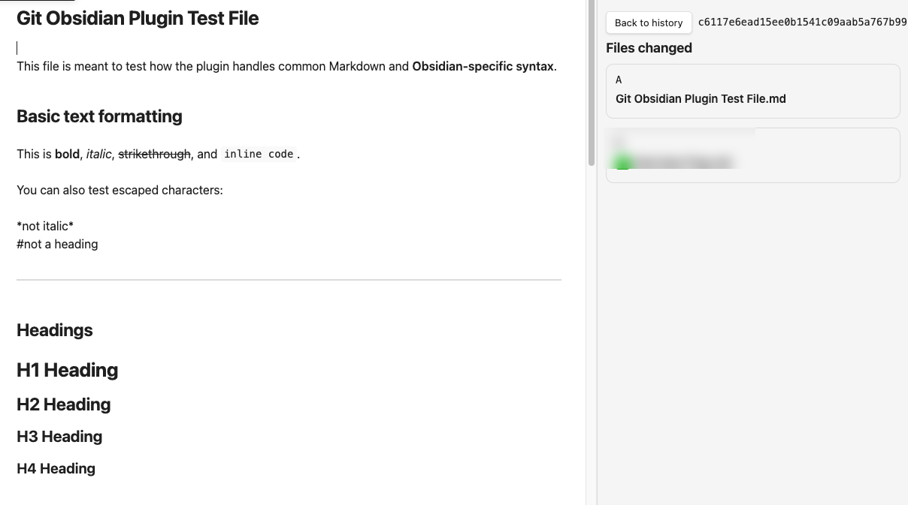
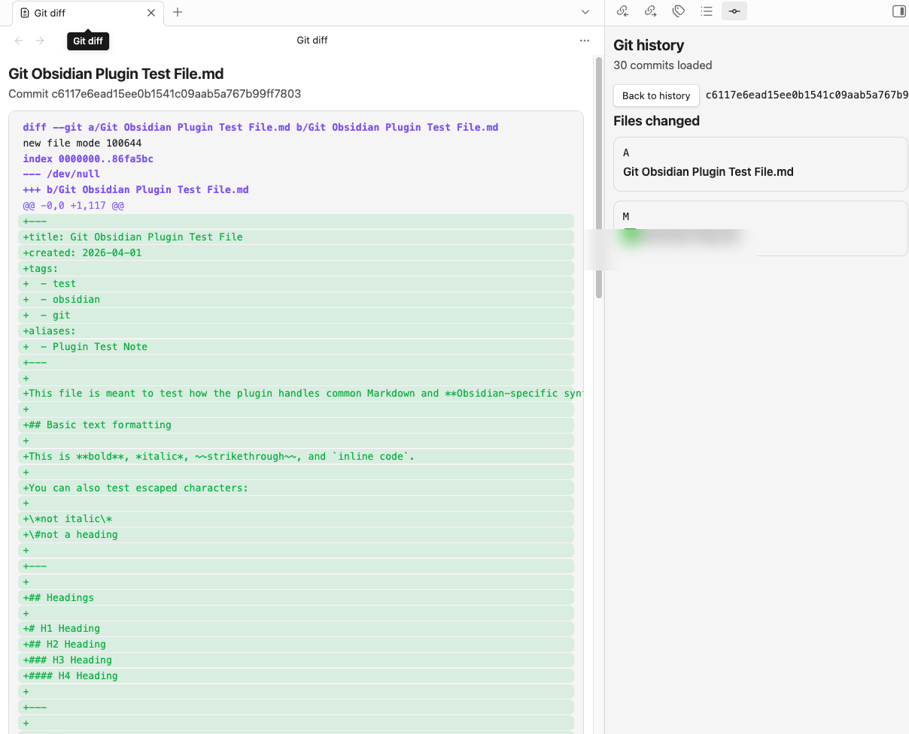

# Git Obsidian

Git Obsidian is a desktop-only Obsidian plugin for syncing an existing vault repository with GitHub over HTTPS. It watches saved vault activity, creates a commit when needed, fetches and merges remote changes, pushes the configured branch, and lets you inspect Git history and file diffs without leaving Obsidian.

## Highlights

- Automatic sync after a configurable idle window following saved edits
- Manual sync and pause/resume commands
- Automatic commit creation with configurable commit message templates
- Git history sidebar with commit detail and changed-file drill-down
- Per-file diff view for inspecting a selected commit
- Optional notifications for commit, merge, push, and error events
- Automatic detection of the current branch and origin remote
- Markdown conflict preservation when auto-merge is enabled

## Screenshots



*Commit detail view in the Git history sidebar.*



*Per-file diff view opened from a selected commit.*

## Requirements

- Obsidian desktop
- `git` installed and available on the system path
- A vault whose root folder is already a Git repository
- A GitHub HTTPS repository remote
- A GitHub username and personal access token with repository access

## Build

```bash
npm ci
npm run build
```

This produces the plugin bundle in `main.js` and uses the checked-in `manifest.json` and `styles.css` files for installation.

## Install In An Obsidian Vault

Create the plugin folder inside your vault:

```bash
mkdir -p "<VaultPath>/.obsidian/plugins/git-obsidian"
```

Copy the built plugin files into it:

```bash
cp manifest.json "<VaultPath>/.obsidian/plugins/git-obsidian/"
cp main.js "<VaultPath>/.obsidian/plugins/git-obsidian/"
cp styles.css "<VaultPath>/.obsidian/plugins/git-obsidian/"
```

Then open `Settings -> Community plugins`, reload plugins or restart Obsidian, and enable `Git Obsidian`.

## Install In An iCloud Vault On macOS

If your vault lives in iCloud Drive, the path is usually under:

```bash
$HOME/Library/Mobile Documents/iCloud~md~obsidian/Documents/<VaultName>
```

Example:

```bash
mkdir -p "$HOME/Library/Mobile Documents/iCloud~md~obsidian/Documents/Notes/.obsidian/plugins/git-obsidian"
cp manifest.json "$HOME/Library/Mobile Documents/iCloud~md~obsidian/Documents/Notes/.obsidian/plugins/git-obsidian/"
cp main.js "$HOME/Library/Mobile Documents/iCloud~md~obsidian/Documents/Notes/.obsidian/plugins/git-obsidian/"
cp styles.css "$HOME/Library/Mobile Documents/iCloud~md~obsidian/Documents/Notes/.obsidian/plugins/git-obsidian/"
```

Reload community plugins or restart Obsidian after copying the files.

## Development Install

For local development, symlink the repo into the vault plugin directory so rebuilt files are picked up without manual copying:

```bash
ln -s "/absolute/path/to/git-obsidian" "<VaultPath>/.obsidian/plugins/git-obsidian"
```

Rebuild after source changes:

```bash
npm run build
```

Reload community plugins or restart Obsidian after each rebuild.

## Configuration

- `syncIntervalMinutes`: Minutes to wait after the last saved vault change before automatic sync runs.
- `autoCommit`: Create a commit automatically when local changes are detected before sync.
- `autoMerge`: Merge remote changes automatically and preserve supported note conflicts when possible.
- `notifyOnError`: Show a notice when sync fails or configuration blocks Git operations.
- `notifyOnCommit`: Show a notice when the plugin creates an automatic sync commit.
- `notifyOnMerge`: Show a notice when the plugin resolves and completes a merge.
- `notifyOnPush`: Show a notice when the plugin pushes changes to the remote branch.
- `commitMessageTemplate`: Template for automatic commit messages.
- `githubUsername`: GitHub username used for HTTPS authentication and the `{{gitUser}}` placeholder.
- `githubToken`: GitHub personal access token stored in plugin data so unattended sync can run.
- `remoteUrl`: GitHub HTTPS repository URL. Embedded credentials are rejected.
- `branch`: Checked-out branch the plugin will sync against.

Supported commit template placeholders:

- `{{datetime}}`
- `{{gitUser}}`
- `{{userName}}`
- `{{fileName}}`
- `{{filename}}`

## Commands

- `Sync notes with Git now`
- `Pause or resume automatic Git sync`
- `Open Git history`

## How Sync Works

1. The plugin waits for saved vault activity, then schedules sync for the configured interval.
2. If the repository is dirty and `autoCommit` is enabled, it stages all changes and creates a commit from your template.
3. It fetches the configured GitHub branch over HTTPS.
4. It fast-forwards or merges `FETCH_HEAD`.
5. If merge conflicts remain in supported note files, it preserves both versions in the note content and finishes the merge commit.
6. It pushes `HEAD` to the configured branch.

## Notes And Limitations

- Desktop only.
- GitHub HTTPS remotes only. SSH remotes and embedded credentials are rejected.
- The vault root must also be the Git repository root.
- The plugin does not initialize or clone repositories.
- Copying new plugin files into `.obsidian/plugins` does not reload the running plugin automatically.
- The plugin operates on saved files on disk. Unsaved editor changes are not visible to Git yet.
- The GitHub token is stored in Obsidian plugin data so unattended sync can run. Use a least-privilege token.
- The history view displays commit author names and email addresses reported by Git.

## Development

```bash
npm test
npm run lint
npm run build
```
